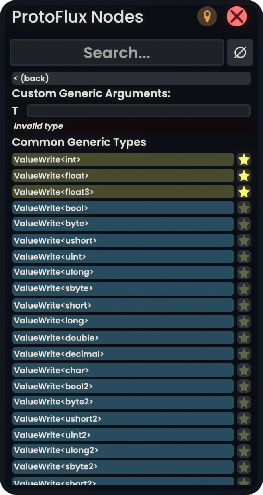

# CherryTypes

A [ResoniteModLoader](https://github.com/resonite-modding-group/ResoniteModLoader) mod for [Resonite](https://resonite.com/) that does something.

This mod lets you favorite generic types (components and ProtoFlux nodes are planned in the future). Favorited types are pinned to the top for easier access. If you specify a custom generic argument, it can also be favorited.

I made this mod to complement [Cyro's CherryPick mod](https://cyro.blue/cyro/CherryPick) because typing on a VR keyboard is slow.

## Screenshots



Note: The search bar is provided by CherryPick.

## Installation

1. Install [ResoniteModLoader](https://github.com/resonite-modding-group/ResoniteModLoader).
1. Place [CherryTypesName.dll](https://github.com/ColinTimBarndt/resonite-cherry-types-mod/releases/latest/download/CherryTypesName.dll) into your `rml_mods` folder. This folder should be at `C:\Program Files (x86)\Steam\steamapps\common\Resonite\rml_mods` for a default install. You can create it if it's missing, or if you launch the game once with ResoniteModLoader installed it will create this folder for you.
1. Start the game. If you want to verify that the mod is working you can check your Resonite logs.

## Configuration

The configuration uses a fully qualified type notation. If you want to change the order in which favorites appear, this is where you can change it.

```json
{
  "version": "1.0.0",
  "values": {
    "Enabled": true,
    "Favorites": {
      "Types": [
        "System.Int32",
        "System.Single",
        "[Elements.Core]Elements.Core.float3"
      ]
    }
  }
}
```
